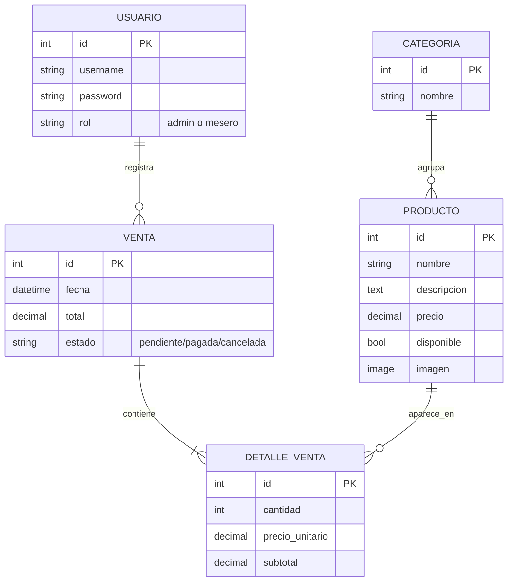

# 📖 Clase 04 — Modelos en Django (las "recetas" de la cocina)

> 🎯 **Objetivo**: Entender qué es un Modelo, sus tipos de campos, relaciones (ForeignKey) y migraciones.
> ⏱️ **Tiempo**: 10 minutos
> 📚 **Pre-requisitos**: Clase [`02-django-venv-dependencias.md`](02-django-venv-dependencias.md)

---

## 🤔 El problema

Necesitamos guardar información: usuarios, productos, ventas. Esa información vive en una **base de datos** (PostgreSQL o SQLite).

Pero escribir SQL a mano para cada tabla es lento y propenso a errores:

```sql
CREATE TABLE producto (
    id SERIAL PRIMARY KEY,
    nombre VARCHAR(100) NOT NULL,
    precio DECIMAL(8,2) NOT NULL,
    ...
);
```

## 🍳 La solución: Modelos

Un **Modelo** en Django es una **clase de Python** que representa una tabla. Django la traduce automáticamente a SQL por ti.

```python
class Producto(models.Model):
    nombre = models.CharField(max_length=100)
    precio = models.DecimalField(max_digits=8, decimal_places=2)
```

Esto es EQUIVALENTE al SQL de arriba, pero mucho más simple de escribir y mantener.

### Analogía
Un Modelo es la **receta escrita** de un plato: define QUÉ ingredientes tiene (campos) y de QUÉ TIPO es cada uno (texto, número, fecha...). La base de datos es la **despensa** donde se guardan las instancias reales de esa receta (cada producto concreto).

---

## 🧱 Tipos de campos más comunes

| Campo Django | Para qué sirve | Ejemplo en MenuPOS |
|---|---|---|
| `CharField(max_length=N)` | Texto corto (obligatorio el límite) | Nombre del producto |
| `TextField()` | Texto largo, sin límite fijo | Descripción |
| `DecimalField(max_digits, decimal_places)` | Números exactos (¡dinero!) | Precio |
| `IntegerField()` | Números enteros | Cantidad |
| `BooleanField()` | Verdadero/falso | ¿Está disponible? |
| `DateTimeField(auto_now_add=True)` | Fecha/hora, se llena sola al crear | Fecha de la venta |
| `ImageField(upload_to=...)` | Imagen (requiere Pillow, ya instalado) | Foto del producto |
| `ForeignKey(OtroModelo, on_delete=...)` | Relación con OTRA tabla | Producto → pertenece a → Categoría |

> ⚠️ **Importante**: para dinero SIEMPRE usa `DecimalField`, nunca `FloatField`. Los floats pierden precisión (ej: `0.1 + 0.2 = 0.30000000000000004` en muchos lenguajes) y eso en un sistema de ventas es un bug carísimo.

---

## 🔗 ForeignKey — cómo se relacionan las tablas

Un `ForeignKey` dice "este registro **pertenece a** otro registro de otra tabla".

```python
class Producto(models.Model):
    nombre = models.CharField(max_length=100)
    categoria = models.ForeignKey(
        Categoria,           # ¿A qué modelo apunta?
        on_delete=models.CASCADE,  # ¿Qué pasa si se borra la Categoria?
        related_name='productos'   # Nombre para consultar "al revés"
    )
```

### ¿Qué es `on_delete`?
Define qué pasa con este registro si el registro relacionado se elimina:

| Opción | Comportamiento |
|---|---|
| `CASCADE` | Si borras la Categoría, se borran TODOS sus Productos también |
| `PROTECT` | Impide borrar la Categoría si tiene Productos asociados |
| `SET_NULL` | Si borras la Categoría, el Producto queda sin categoría (`null`) |

### Analogía
Si `Categoria` es una **sección del menú** (ej: "Hamburguesas") y `Producto` es cada plato, el `ForeignKey` es como escribir en la receta "esto pertenece a la sección Hamburguesas". Si borras la sección completa, `CASCADE` significa "también se van todos los platos de esa sección".

---

## 🏗️ El esquema de datos de MenuPOS

Vamos a crear estos modelos:



### Explicación de cada modelo

- **Usuario**: extiende el sistema de usuarios de Django, agregando un campo `rol` (admin o mesero)
- **Categoria**: agrupa productos (ej: "Hamburguesas", "Bebidas")
- **Producto**: cada plato/bebida del menú, pertenece a una Categoría
- **Venta**: una transacción completa (un pedido cobrado), registrada por un Usuario (mesero)
- **DetalleVenta**: CADA línea de una venta (ej: "2x Hamburguesa Clásica"). Una Venta tiene VARIOS DetalleVenta

> 💡 **¿Por qué separar Venta y DetalleVenta?** Porque una venta puede tener múltiples productos. Es la diferencia entre "la factura completa" (Venta) y "cada línea de la factura" (DetalleVenta).

---

## 🔄 ¿Qué es una migración?

Cuando **cambias** un modelo (agregas un campo, quitas otro), Django necesita **actualizar la base de datos real** para que coincida.

```bash
python manage.py makemigrations   # 1. Genera el "plan de cambios" (archivo Python)
python manage.py migrate          # 2. Aplica ese plan a la base de datos real
```

### Analogía
- `makemigrations` = el **arquitecto dibuja los planos** de la remodelación
- `migrate` = los **obreros ejecutan** la remodelación en el local real

Nunca se salta un paso: primero planos, después obra.

---

## 🖥️ El Admin de Django (bonus)

Django trae un **panel de administración web** automático en `/admin`. Con solo "registrar" un modelo:

```python
# admin.py
from django.contrib import admin
from .models import Producto

admin.site.register(Producto)
```

Obtienes gratis una interfaz web para crear, editar y borrar productos — sin escribir ni una línea de HTML.

### Analogía
Es como si, al construir la cocina, Django te regalara además una **libreta de inventario digital** para que el administrador anote y edite productos sin tocar código.

---

## 🧠 Quiz rápido

1. ¿Qué representa un Modelo de Django?
2. ¿Por qué usamos `DecimalField` y no `FloatField` para el precio?
3. ¿Qué hace un `ForeignKey`?
4. Si borro una Categoría y sus Productos usan `on_delete=CASCADE`, ¿qué pasa?
5. ¿Cuál es la diferencia entre `makemigrations` y `migrate`?
6. ¿Por qué separamos `Venta` de `DetalleVenta` en vez de un solo modelo?
7. ¿Para qué sirve `/admin` en Django?

> 📝 Respuestas en el quiz de FASE 4.

---

## ➡️ Qué sigue

Vamos a crear estos modelos en código real: `users/models.py`, `menu/models.py`, `sales/models.py`. Luego migramos y probamos todo en `/admin`.

---

## 🔗 Referencias

- [Django Models (documentación oficial)](https://docs.djangoproject.com/es/5.1/topics/db/models/)
- [Tipos de campos de Django](https://docs.djangoproject.com/es/5.1/ref/models/fields/)
- [Django Admin](https://docs.djangoproject.com/es/5.1/ref/contrib/admin/)
