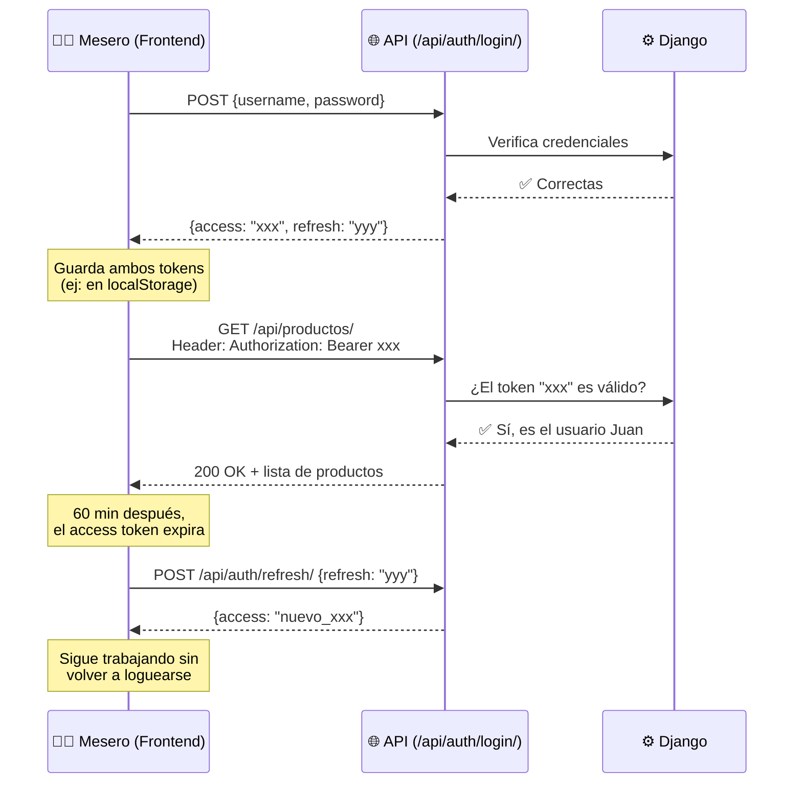

# 📖 Clase 07 — JWT en la práctica (la pulsera VIP)

> 🎯 **Objetivo**: Entender cómo funciona el login con JWT paso a paso.
> ⏱️ **Tiempo**: 8 minutos
> 📚 **Pre-requisitos**: Clase [`06-viewsets-routers.md`](06-viewsets-routers.md)

---

## 🤔 El problema

HTTP es **"sin memoria"**: cada petición es independiente, el servidor no recuerda quién eres de una petición a otra.

Si no verificamos identidad, **cualquiera** podría crear ventas o editar el menú.

## 🎫 La solución: JWT (JSON Web Token)

Cuando el usuario hace login, el servidor le entrega una **pulsera digital** (token) que:
- Prueba quién es, sin tener que loguearse en cada petición
- Tiene fecha de vencimiento
- No se puede falsificar (está firmado criptográficamente con el `SECRET_KEY`)

### Los 2 tokens de SimpleJWT

| Token | Analogía | Duración (en MenuPOS) |
|---|---|---|
| **Access Token** | La pulsera que usas TODO el turno | 60 minutos |
| **Refresh Token** | El comprobante para pedir una pulsera nueva sin hacer fila | 7 días |

---

## 🎬 El flujo completo



---

## 🔧 Cómo lo activamos en MenuPOS

Ya instalamos `djangorestframework-simplejwt` en FASE 2. Solo agregamos las URLs:

```python
from rest_framework_simplejwt.views import TokenObtainPairView, TokenRefreshView

urlpatterns = [
    path('api/auth/login/', TokenObtainPairView.as_view()),    # da access + refresh
    path('api/auth/refresh/', TokenRefreshView.as_view()),     # renueva el access
]
```

Y en `settings.py` ya configuramos (desde FASE 2):

```python
REST_FRAMEWORK = {
    'DEFAULT_AUTHENTICATION_CLASSES': (
        'rest_framework_simplejwt.authentication.JWTAuthentication',
    ),
    'DEFAULT_PERMISSION_CLASSES': (
        'rest_framework.permissions.IsAuthenticated',
    ),
}
```

Esto significa: **por defecto**, TODA la API exige un token válido, excepto las vistas que digamos explícitamente lo contrario (como el login mismo).

---

## 🧪 Cómo se prueba con `curl`

```bash
# 1. Login: pedir la pulsera
curl -X POST http://localhost:8000/api/auth/login/ \
  -H "Content-Type: application/json" \
  -d '{"username": "admin", "password": "TU_PASSWORD"}'

# Respuesta: {"access": "eyJhbG...", "refresh": "eyJhbG..."}

# 2. Usar la pulsera para pedir productos
curl http://localhost:8000/api/productos/ \
  -H "Authorization: Bearer eyJhbG..."
```

Sin el header `Authorization`, la API responde `401 Unauthorized` — el guardia no te deja pasar sin pulsera.

---

## 🧠 Quiz rápido

1. ¿Por qué HTTP necesita algo como JWT para "recordar" quién eres?
2. ¿Cuál es la diferencia entre access token y refresh token?
3. ¿Qué pasa si mandas una petición sin el header `Authorization`?
4. ¿Dónde se define cuánto dura cada token en MenuPOS?

> 📝 Respuestas en el quiz de FASE 5.

## 🔗 Referencias
- [SimpleJWT (documentación oficial)](https://django-rest-framework-simplejwt.readthedocs.io/)
- [JWT.io — cómo se ve un token por dentro](https://jwt.io/)
