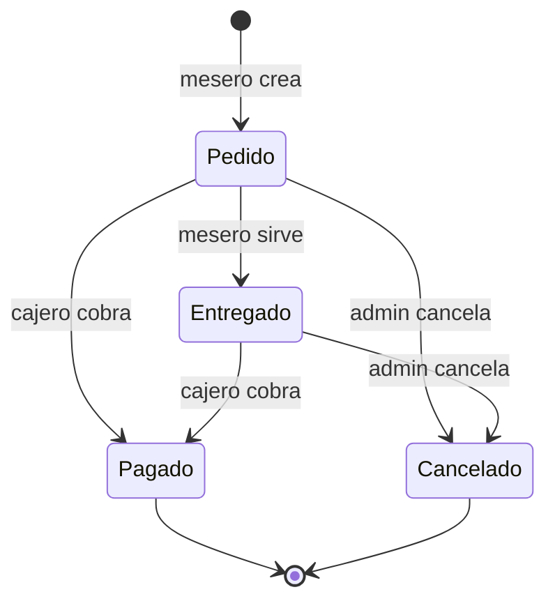

# 📖 Clase 11 — Estados de un pedido y reglas de negocio

> 🎯 **Objetivo**: Entender qué es una "máquina de estados" y por qué las reglas de negocio viven en el backend.
> ⏱️ **Tiempo**: 9 minutos
> 📚 **Pre-requisitos**: Clase [`05-serializers.md`](05-serializers.md), [`06-viewsets-routers.md`](06-viewsets-routers.md)

---

## 🤔 El problema

Un pedido en un restaurante no es "creado" y ya. Pasa por **etapas**:

1. El mesero lo **toma** (va a cocina)
2. El mesero lo **entrega** en la mesa
3. El cajero lo **cobra**
4. (o en cualquier momento se **cancela**)

Necesitamos representar esas etapas y **controlar qué transiciones son válidas y quién puede hacerlas**.

---

## 🔄 ¿Qué es una máquina de estados?

Una **máquina de estados** es un modelo donde algo (aquí, un pedido) solo puede estar en **uno de varios estados definidos**, y solo puede **moverse entre ellos siguiendo reglas**.

### El ciclo de vida de un pedido en MenuPOS



- **Pedido** (amarillo): recién tomado, en cocina
- **Entregado** (azul): servido en la mesa, cliente comiendo, aún no paga
- **Pagado** (verde): cerrado, cobrado ✅
- **Cancelado** (rojo): anulado ❌

### Analogía
Es como el estado de un envío: "preparando" → "en camino" → "entregado". No puedes saltar de "preparando" a "entregado" sin pasar por el flujo, y no cualquiera puede cambiarlo (el repartidor marca "entregado", no tú).

---

## 🔐 ¿Quién puede hacer cada transición?

No todos los roles pueden mover el pedido en cualquier dirección:

| Transición | ¿Quién? | Por qué |
|---|---|---|
| Crear → Pedido | Mesero o Admin | Cualquiera toma pedidos |
| Pedido → Entregado | Mesero o Admin | El mesero es quien lleva los platos |
| → Pagado | **Solo Admin** | Cobrar es decisión de caja |
| → Cancelado | **Solo Admin** | Anular afecta el dinero |

### Cómo se implementó (en `sales/views.py`)

```python
ESTADOS_SOLO_ADMIN = (Venta.Estado.PAGADO, Venta.Estado.CANCELADO)

@action(detail=True, methods=['post'])
def marcar_estado(self, request, pk=None):
    venta = self.get_object()
    nuevo_estado = request.data.get('estado')

    # Validar que el estado exista
    if nuevo_estado not in Venta.Estado.values:
        return Response({'error': '...'}, status=400)

    # Regla de negocio: pagar/cancelar es solo del admin
    if nuevo_estado in self.ESTADOS_SOLO_ADMIN and request.user.rol != 'admin':
        return Response({'error': '...'}, status=403)

    venta.estado = nuevo_estado
    venta.save()
    return Response(VentaSerializer(venta).data)
```

> 💡 Nota importante: separamos esto en un endpoint dedicado (`/marcar_estado/`) en vez de un `PATCH` genérico. Así el `estado` es de solo lectura en el serializer y la ÚNICA forma de cambiarlo pasa por estas reglas — nadie puede colar un cambio de estado editando la venta completa.

---

## 💰 Regla de oro: la lógica de negocio va en el BACKEND

¿Por qué no dejar que el frontend decida el precio, el total o el estado?

**Porque el frontend NO es confiable.** Cualquiera puede abrir las herramientas de desarrollo del navegador y modificar el JavaScript. Si confiáramos en el frontend:
- Podría mandar un total de $1 por una comida de $50.000
- Un mesero podría marcar su propia venta como "pagada" sin cobrar

Por eso en MenuPOS **el servidor es la única fuente de verdad**:
- El `precio_unitario` se toma de `producto.precio` en el backend (clase 05)
- El `total` se calcula sumando en el backend
- El `estado` solo cambia por reglas del backend

### Analogía
El frontend es el **mesero que toma la orden** (conveniente, amable), pero la **caja registradora (backend)** es la que realmente cuenta el dinero. Nunca dejarías que el cliente escriba él mismo cuánto va a pagar.

---

## 🍽️ Cuenta abierta por mesa (otra regla de negocio)

Cuando una mesa con cuenta abierta (estado `pedido` o `entregado`) pide algo más, **no creamos otra venta** — sumamos a la existente. Esto vive en `VentaSerializer.create()`:

```python
# ¿Ya hay una cuenta abierta (sin pagar) para esta mesa?
venta = Venta.objects.filter(
    tipo=Venta.Tipo.MESA,
    mesa=mesa,
    estado__in=Venta.ESTADOS_ABIERTOS,  # pedido o entregado
).first()

if venta is None:
    venta = Venta.objects.create(...)  # nueva cuenta
# ... se suman los productos y el total ...
```

Y como hay productos nuevos por preparar, la cuenta vuelve a estado `pedido`.

---

## 🧠 Quiz rápido

1. ¿Qué es una máquina de estados, en una frase?
2. ¿Por qué el mesero puede marcar "entregado" pero no "pagado"?
3. ¿Por qué el estado se cambia con un endpoint dedicado y no con un PATCH normal?
4. ¿Por qué NO se debe confiar en el frontend para el precio o el total?
5. ¿Qué pasa cuando una mesa con cuenta abierta pide otra bebida?

> 📝 Respuestas en el quiz de esta ronda (fase-06b).

---

## 🔗 Referencias
- [Máquina de estados finitos (Wikipedia)](https://es.wikipedia.org/wiki/Aut%C3%B3mata_finito)
- [DRF custom actions (@action)](https://www.django-rest-framework.org/api-guide/viewsets/#marking-extra-actions-for-routing)
