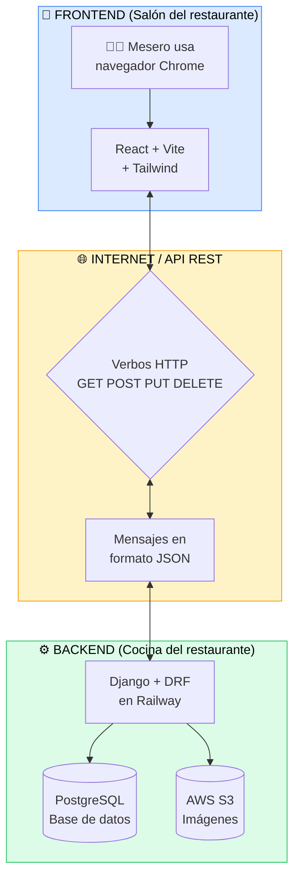
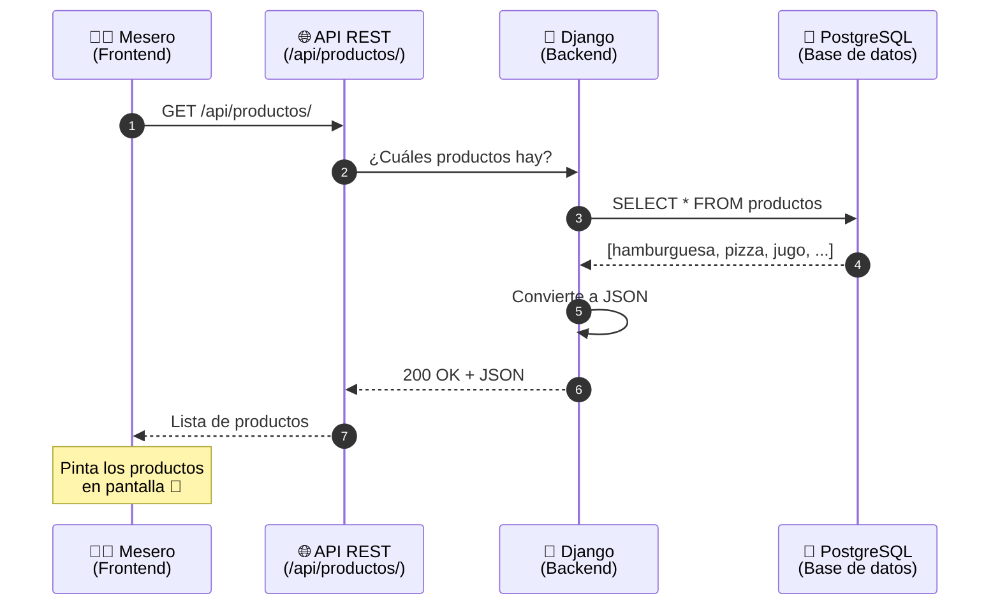
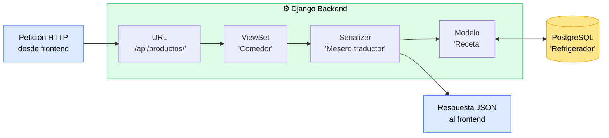

# 📊 Diagrama 01 — Visión general de MenuPOS

> 🎯 **Para qué sirve**: ver de un vistazo cómo está armado todo MenuPOS y cómo fluye la información.
> 📖 **Clase asociada**: [`../clases/01-arquitectura.md`](../clases/01-arquitectura.md)

---

## 🏗️ La arquitectura completa

Este diagrama muestra **todas las piezas** de MenuPOS y cómo se conectan.

> 💡 **Tip**: En GitHub este diagrama se ve renderizado automáticamente como imagen.

---

## 🔄 Flujo de una petición típica

Imaginemos que el mesero abre la lista de productos:

---

## 🗂️ Capas del backend (cómo Django organiza la cocina)

Esto es **lo que está dentro del backend** específicamente:

### ¿Qué hace cada pieza?

| Pieza | Rol en el restaurante | Qué hace técnicamente |
|---|---|---|
| **URL** | 🚪 Puerta del comedor | Decide a qué función llevar la petición |
| **ViewSet** | 🍽️ Comedor | Recibe la petición, decide qué hacer |
| **Serializer** | 🧑‍💼 Mesero traductor | Convierte entre objetos Python y JSON |
| **Modelo** | 📖 Receta | Define cómo se ve un dato en la BD |
| **PostgreSQL** | ❄️ Refrigerador | Guarda todos los datos físicamente |

> 📚 Cada una de estas piezas tendrá su propia mini-clase cuando llegue su momento.

---

## 🎯 Cómo usar este diagrama en una entrevista

Cuando te pregunten "¿cómo está armado tu proyecto?":

1. Abre este archivo en GitHub
2. Muestra el primer diagrama (visión general)
3. Explica: "Tengo un frontend en React que llama a una API REST construida en Django, que guarda datos en PostgreSQL y las imágenes en AWS S3"
4. Si quieren más detalle, abre el diagrama de capas del backend
5. Explica cada pieza usando la metáfora del restaurante

**Pum**. Te ven como un dev que **entiende** lo que construyó.

---

## 🔗 Diagramas relacionados (próximamente)

- `02-modelo-er.md` → Cómo se relacionan las tablas de la BD
- `03-flujo-autenticacion.md` → Cómo funciona el login con JWT
- `04-flujo-crear-venta.md` → Cómo se procesa una venta desde el botón "Cobrar"
