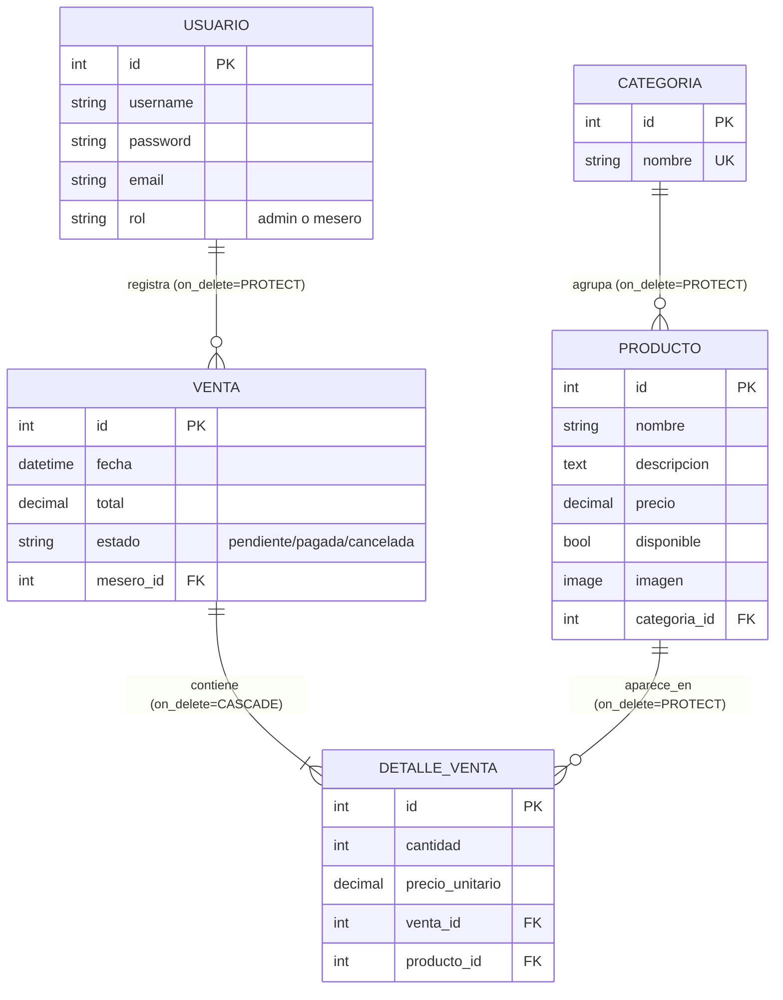

# 📊 Diagrama 02 — Modelo Entidad-Relación (implementado)

> 📖 **Clase asociada**: [`../clases/04-modelos-django.md`](../clases/04-modelos-django.md)
> 🎯 **Para qué sirve**: ver la estructura REAL de la base de datos de MenuPOS, tal como quedó implementada en FASE 4.

---

## 🗄️ Esquema completo

---

## 🔍 Por qué cada `on_delete` es el que es

| Relación | on_delete | Razón |
|---|---|---|
| Producto → Categoria | `PROTECT` | No queremos borrar accidentalmente una categoría con productos activos |
| Venta → Usuario (mesero) | `PROTECT` | Una venta histórica siempre debe saber quién la hizo — no se puede borrar un mesero con ventas |
| DetalleVenta → Venta | `CASCADE` | Si se borra la Venta completa, sus líneas ya no tienen sentido — se borran con ella |
| DetalleVenta → Producto | `PROTECT` | No se puede borrar un producto que ya fue vendido (rompería el historial) |

---

## 🎯 Cómo usar esto en una entrevista

> "¿Cómo diseñaste tu base de datos?"

1. Abre este diagrama
2. Explica: "Separé Venta de DetalleVenta para soportar múltiples productos por venta"
3. Explica las decisiones de `on_delete`: "Uso PROTECT en las relaciones donde perder el dato rompería el historial, y CASCADE solo donde tiene sentido borrar en cascada"
4. Menciona el "snapshot de precio": `precio_unitario` se guarda en cada DetalleVenta para no alterar ventas pasadas si el precio cambia después

Eso demuestra pensamiento de diseño, no solo "until it works".
