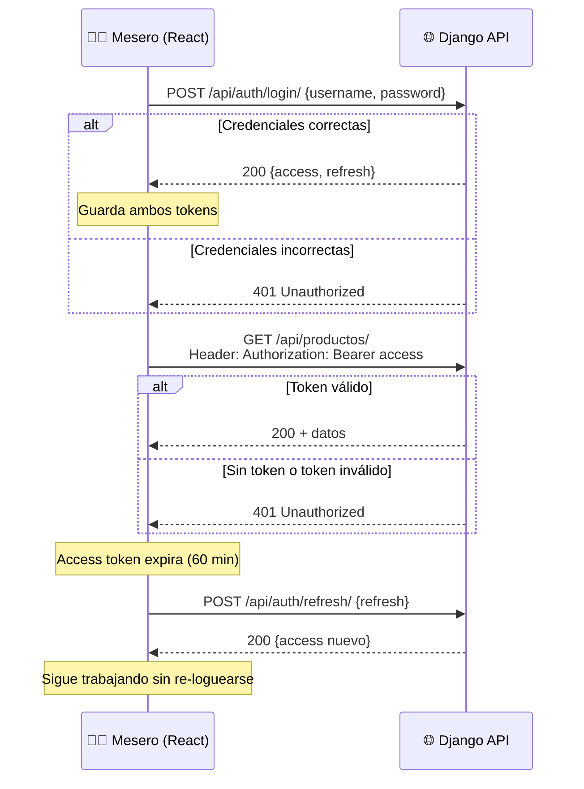
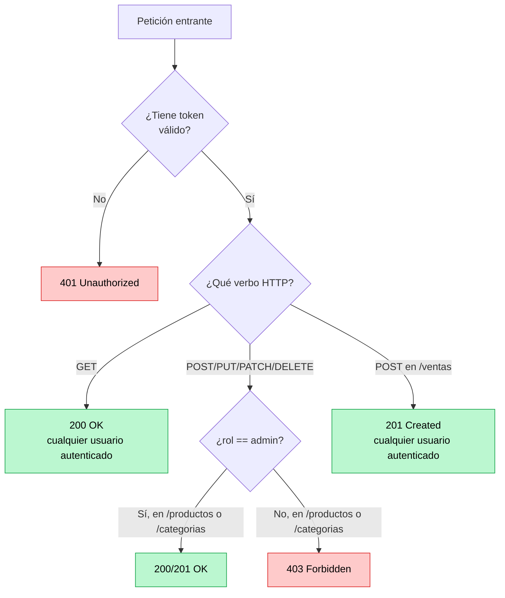

# 📊 Diagrama 03 — Flujo de autenticación JWT

> 📖 **Clase asociada**: [`../clases/07-jwt-autenticacion.md`](../clases/07-jwt-autenticacion.md)

---

## 🔐 Login → petición autenticada → renovación

---

## 🛡️ Permisos por rol dentro de la API

> 💡 Nota: cualquier usuario autenticado (mesero o admin) puede **leer** el menú y **crear** ventas. Solo un **admin** puede crear/editar/borrar categorías y productos.
